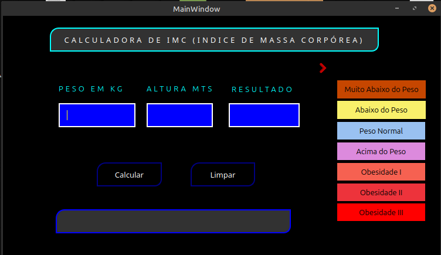

# Calculadora de IMC com PyQt5

Este é um aplicativo simples de cálculo de IMC (Índice de Massa Corporal) criado com Python e PyQt5. Ele permite calcular o IMC e mostra uma seta indicativa com base na faixa de peso.

## Capturas de Tela



## Requisitos

- Python 3.x
- PyQt5 (`pip install pyqt5`)

## Como usar

1. Clone o repositório:
   ```bash
   git clone https://github.com/paulocastanha33/imc_python.git
